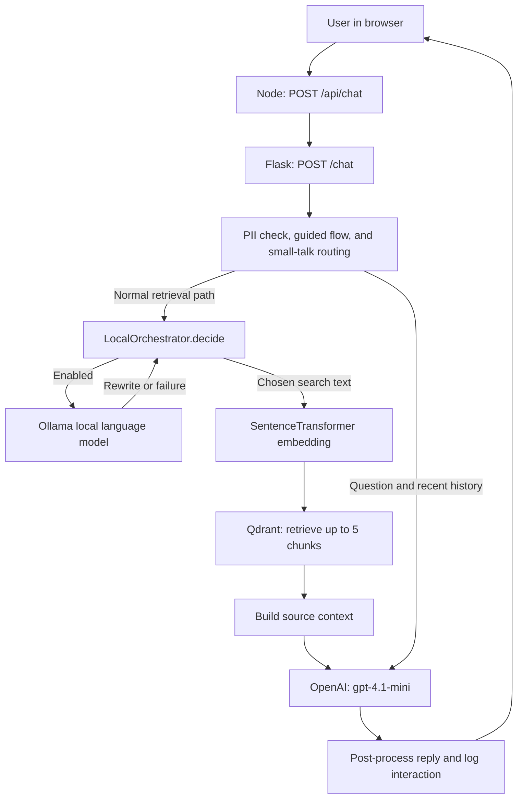
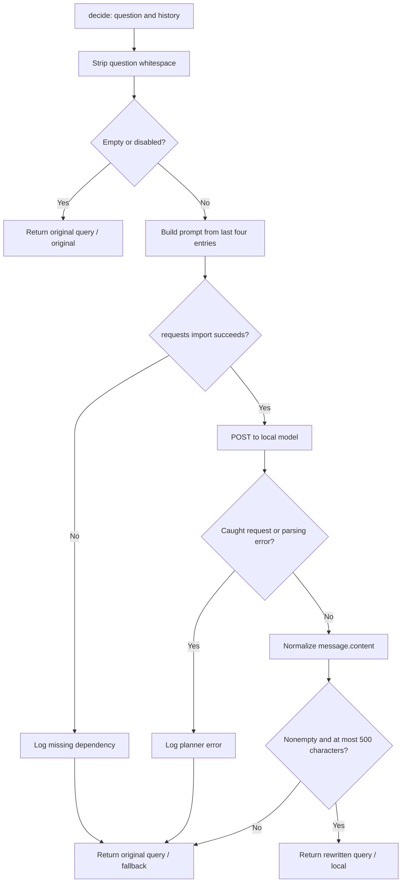
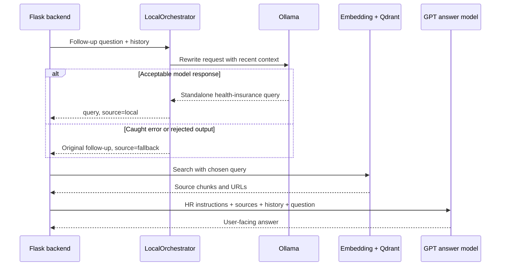
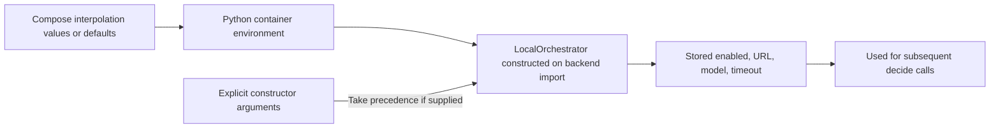

# Understanding Rammy’s Local Orchestrator

**Source snapshot: September 18, 2026.** This guide describes the checked-out code and configuration. It does not establish whether your Docker services are running or whether the local model is installed. Examples of model output are illustrative, not recorded model responses.

The local orchestrator is an **optional question-rewriting step before document retrieval**. It asks a local model to turn the current message, plus a little conversation history, into a standalone HR search query. The backend searches Qdrant using that query, then asks the configured OpenAI answer model to write the response.

Despite its name, this class does not manage Docker services, run an autonomous agent loop, select tools, or generate the final answer. Its public operation is essentially:

```text
question + recent conversation → retrieval query + source label
```

## 1. Where it fits in the application



*Reading the diagram:* the local model prepares the search text. The embedding model converts that text into numbers for Qdrant. The answer model receives retrieved material and writes the user-facing answer. These are three separate model responsibilities.

| Component | Current responsibility | Owned by |
|---|---|---|
| Query planner | Rewrite the question with recent conversation context | `local_orchestrator.py`, Ollama |
| Embedding model | Convert chosen query to a vector | `all-MiniLM-L6-v2`, in `chatbot_api.py` |
| Retrieval | Find up to five similar stored chunks | Qdrant collection `rammy_hr` |
| Context assembly | Format chunk text and source URLs; place web results before PDFs | `build_context()` |
| Answer generation | Respond using instructions, context, history, and the question | `gpt-4.1-mini`, in `ask_model()` |
| Guided eligibility flow | Ask structured follow-up questions and synthesize an eligibility question | `handle_guided_flow()` |

The distinction matters: turning off local orchestration removes the rewriting step. It does not remove Qdrant or replace the OpenAI answer model.

## 2. The actual integration point

The backend creates one orchestrator object at module initialization:

```python
_orchestrator = LocalOrchestrator()
```

In the ordinary retrieval branch of `ask_model()`, these two lines connect planning to search:

```python
        retrieval_query = _orchestrator.decide(question, history).query
        context = build_context(retrieval_query, chunks)
```

Notice `.query`: the caller takes the chosen text and discards the decision’s `source` label. The rewrite is used for retrieval; it is not assigned back to `question`.

Later, the answer request uses the question passed into `ask_model()`:

```python
        messages = (
            [{"role": "system", "content": system_prompt}]
            + trimmed_history
            + [{"role": "user", "content": question}]
        )
```

The final ordinary answer call is:

```python
    response = client.chat.completions.create(
        model=MODEL,
        messages=messages,
        max_tokens=300,
        temperature=0.3,   # Lower temp = more consistent, factual replies
    )
```

For a normal chat message, that means GPT receives the original question, not the local rewrite, as its final user message. For a completed guided flow, `question` is already a synthesized eligibility question. The local rewrite can still change the answer indirectly because it changes which documents are retrieved.

## 3. Walkthrough of `local_orchestrator.py`

### 3.1 The return object: `OrchestrationDecision`

```python
@dataclass(frozen=True)
class OrchestrationDecision:
    """The retrieval query and the reason it was selected."""

    query: str
    source: str
```

This Python dataclass groups two values:

| Field | Meaning | Example |
|---|---|---|
| `query` | Text that should be sent to retrieval | `WCU part-time employee health insurance eligibility` |
| `source` | Which branch selected the query | `original`, `local`, or `fallback` |

`frozen=True` prevents ordinary reassignment of the fields after construction. `source` is a branch label, not a citation to an HR document or a quality score.

### 3.2 Initialization and settings

```python
    def __init__(
        self,
        enabled: Optional[bool] = None,
        base_url: Optional[str] = None,
        model: Optional[str] = None,
        timeout: Optional[float] = None,
    ) -> None:
        configured = os.getenv("LOCAL_ORCHESTRATOR_ENABLED", "false").lower()
        self.enabled = enabled if enabled is not None else configured in {"1", "true", "yes", "on"}
        self.base_url = (base_url or os.getenv("LOCAL_MODEL_BASE_URL", "http://host.docker.internal:11434")).rstrip("/")
        self.model = model or os.getenv("LOCAL_MODEL", "llama3.2:3b")
        self.timeout = timeout if timeout is not None else float(os.getenv("LOCAL_MODEL_TIMEOUT", "4"))
```

Explicit constructor arguments take precedence over environment variables. For `enabled` and `timeout`, a value of `None` means “read the environment.” For `base_url` and `model`, the `or` expression also treats an empty string as absent.

The base URL loses trailing slashes so appending `/api/chat` does not create a double slash. The enabled flag is case-insensitive and recognizes `1`, `true`, `yes`, and `on`; it does not strip spaces. For example, `TRUE` enables it, while `true ` does not.

Settings are captured when the object is constructed. Editing `docker/.env` does not update the existing object or a running container’s environment automatically.

### 3.3 Early return: skip unnecessary work

```python
        original = (question or "").strip()
        if not original or not self.enabled:
            return OrchestrationDecision(original, "original")
```

Leading and trailing whitespace is removed first. With an empty question or a disabled orchestrator, the function immediately returns `source="original"` and makes no model request. “Original” therefore means the stripped original text, not necessarily the exact input bytes.

The public Flask route rejects empty messages before this function, but this guard still matters for direct callers.

### 3.4 Build a small conversation prompt

```python
    @staticmethod
    def _planning_prompt(question: str, history: List[Dict[str, Any]]) -> str:
        recent = [
            f"{item.get('role', 'user')}: {item.get('content', '')}"
            for item in history[-4:]
            if isinstance(item, dict) and item.get("content")
        ]
        context = "\n".join(recent)
        return f"Conversation:\n{context}\n\nCurrent message:\n{question}" if context else question
```

The function slices the last **four history entries**, then filters them. Four entries are not four complete user/assistant exchanges. With alternating messages, they are usually about two exchanges.

Only dictionaries with truthy `content` survive. Missing roles default to `user`. Because filtering happens after slicing, an invalid entry in the final four is skipped; an older valid entry is not pulled in to replace it.

If usable history remains, it becomes plain text:

```text
Conversation:
user: Tell me about WCU health insurance.
assistant: Eligibility depends on your employee group and schedule.

Current message:
What about part-time employees?
```

Without usable history, the prompt is just the question. These role prefixes are text inside one user message; history is not sent to Ollama as separate structured chat turns. There is an entry-count limit but no content-length limit here.

### 3.5 Make one synchronous local-model request

```python
            response = requests.post(
                f"{self.base_url}/api/chat",
                json={
                    "model": self.model,
                    "stream": False,
                    "messages": [
                        {
                            "role": "system",
                            "content": (
                                "Rewrite the user's message as one concise standalone HR knowledge-base "
                                "search query. Output only the query, with no quotes or explanation."
                            ),
                        },
                        {"role": "user", "content": prompt},
                    ],
                    "options": {"temperature": 0},
                },
                timeout=self.timeout,
            )
```

The request goes to an Ollama-compatible `/api/chat` endpoint. The payload asks for one concise standalone HR search query, with no surrounding explanation.

| Setting | Effect in this code |
|---|---|
| `model` | Selects the configured local model, default `llama3.2:3b` |
| `stream: False` | Requests a complete response rather than streamed pieces |
| System message | Tells the model to rewrite a query, not answer the HR question |
| User message | Supplies the current message and formatted recent history |
| `temperature: 0` | Requests low-randomness generation; not a validation guarantee |
| `timeout` | Passes the configured timeout to `requests.post()` |

This call is synchronous: retrieval waits for it to finish or fail. The code contains no parallel execution, retry loop, response cache, or explicit output-token limit for Ollama.

### 3.6 Extract, clean, and accept the output

```python
            response.raise_for_status()
            content = response.json().get("message", {}).get("content", "")
            planned = " ".join(str(content).split()).strip(" \"'")
            if planned and len(planned) <= 500:
                return OrchestrationDecision(planned, "local")
```

The code expects response content at `message.content`. It converts that value to a string, splits it on whitespace, joins the pieces with single spaces, then strips spaces and quote characters from both ends.

Illustrative cleanup:

```text
Before:   "  WCU  part-time\nhealth insurance eligibility  "
After:    WCU part-time health insurance eligibility
```

A result is accepted when it is nonempty and no more than **500 Python characters** long after cleanup. Exactly 500 is accepted; 501 is rejected. A long result is rejected, not truncated.

These are shape checks, not meaning checks. A short but inaccurate query, a short explanation, or a short refusal can pass. Because content is stringified, a JSON `null` becomes `"None"` and can pass too. The code does not verify that the rewrite preserved the user’s intent or used only facts from the conversation.

### 3.7 Fall back when planning is unavailable

The optional import has its own fallback:

```python
        try:
            import requests
        except ImportError:
            print("[orchestrator] requests is unavailable; using the original query.")
            return OrchestrationDecision(original, "fallback")
```

Network/response handling ends with:

```python
        except (requests.RequestException, ValueError, TypeError, AttributeError) as error:
            print(f"[orchestrator] Local planner unavailable: {error}")

        return OrchestrationDecision(original, "fallback")
```

Connection errors, HTTP errors raised by `raise_for_status()`, timeouts represented by Requests exceptions, and the listed decoding/type errors lead to the stripped original query. Empty or oversized output also falls back, but does not produce the exception log message.

The fallback protects the retrieval path from the common failures caught here. It does not guarantee successful retrieval or a successful OpenAI answer call.

## 4. Complete decision chart



| Situation | `query` | `source` | Local request? |
|---|---|---|---|
| Disabled | Stripped original | `original` | No |
| Empty question | Empty string | `original` | No |
| Valid accepted rewrite | Normalized model text | `local` | Yes |
| Requests cannot be imported | Stripped original | `fallback` | No |
| Connection, HTTP, or caught parsing error | Stripped original | `fallback` | Attempted |
| Empty or oversized rewrite | Stripped original | `fallback` | Yes |

An accepted model response identical to the original question still has `source="local"`. The label identifies the path taken, not whether the text changed.

## 5. When a chat request reaches the orchestrator

Calling `/chat` does not always call `decide()`.

| Backend route/branch | Orchestrator behavior |
|---|---|
| Empty message | HTTP 400 before planning |
| Current message matches PII detector | Returns privacy warning before planning |
| Guided flow needs another answer | Returns a prepared follow-up question without planning |
| Guided flow finishes | Sends synthesized question to `ask_model()`; eligible for ordinary planning |
| Identity or capability question | Prepared reply; no planning |
| Affirmative follow-up recognized by `small_talk_kind()` | Searches using up to 300 characters of the last assistant reply; bypasses planner |
| Other recognized small talk | Small-talk answer-model prompt; bypasses planner |
| Ordinary question | Calls planner, then retrieves using its chosen query |

The affirmative branch can fall back to greeting-style behavior if it cannot produce a usable contextual answer. It does not then fall through to local planning.

Guided flow and local planning are separate mechanisms. For example, the health-insurance flow asks for employee group, employment type, and hours. Its final branch builds a full question:

```python
        if FLOW_PROGRESS["step"] == "hours":
            group    = FLOW_PROGRESS.get("group", "")
            emp_type = FLOW_PROGRESS.get("type", "")
            hours    = message_lower
            reset_flow()
            return f"__SYNTHESIZED__What health insurance benefits and coverage is a {emp_type} {hours} {group} employee eligible for at WCU?"
```

The route removes `__SYNTHESIZED__` and passes the rest to `ask_model()`. This lets the orchestrator operate on a specific eligibility question instead of a final chip selection such as “Full-time.”

## 6. Worked example: a follow-up question

Suppose the conversation discussed health insurance, and the user now asks:

> What about part-time employees?

The following rewrite is an **illustration**, not a guaranteed model response:

```text
WCU part-time employee health insurance eligibility
```



With the illustrative rewrite, search has explicit topic words rather than needing to infer what “What about” refers to. If the local model is unavailable, search still runs using “What about part-time employees?” The original ambiguity remains; fallback preserves service flow, not necessarily search quality.

If Qdrant yields no usable context, the backend asks GPT for an out-of-scope decline. That is a separate outcome from planner fallback: the planner can succeed while retrieval finds nothing, or fail while the original query retrieves useful content.

## 7. What happens after query planning

The essential retrieval code is:

```python
        query_vector = _embed_model.encode(question).tolist()
        response = _qdrant_client.query_points(
            collection_name=QDRANT_COLLECTION,
            query=query_vector,
            limit=QDRANT_TOP_K,
            with_payload=True,
        )
        results = response.points
```

`QDRANT_TOP_K` is currently `5`. The chosen query is embedded with `all-MiniLM-L6-v2`, then Qdrant returns candidate chunks. `build_context()` skips results without text, turns `pdf:` labels into browser-accessible proxy URLs, places web chunks before PDF chunks when both exist, and formats the source context.

There is no explicit similarity-score threshold in this query call. Receiving results therefore does not itself prove they answer the question. Also, the `chunks` argument remains for compatibility but is ignored by the current `build_context()` implementation.

The orchestrator never receives the retrieved chunks. It plans before retrieval, so it cannot inspect the actual evidence, compare candidate answers, or judge whether the knowledge base supports its rewrite.

## 8. Configuration: Python defaults versus Docker defaults

| Variable | Python class default | Compose default | Meaning |
|---|---|---|---|
| `LOCAL_ORCHESTRATOR_ENABLED` | `false` | `true` | Whether to attempt local rewriting |
| `LOCAL_MODEL_BASE_URL` | `http://host.docker.internal:11434` | `http://ollama:11434` | Local-model service address |
| `LOCAL_MODEL` | `llama3.2:3b` | `llama3.2:3b` | Model requested from Ollama |
| `LOCAL_MODEL_TIMEOUT` | `4` | `4` | Timeout passed to Requests, in seconds |

The actual Compose entries are:

```yaml
            - LOCAL_ORCHESTRATOR_ENABLED=${LOCAL_ORCHESTRATOR_ENABLED:-true}
            - LOCAL_MODEL_BASE_URL=${LOCAL_MODEL_BASE_URL:-http://ollama:11434}
            - LOCAL_MODEL=${LOCAL_MODEL:-llama3.2:3b}
            - LOCAL_MODEL_TIMEOUT=${LOCAL_MODEL_TIMEOUT:-4}
```

At inspection time, `docker/.env` contained no assignments matching these four `NAME=value` keys. Thus the checked-in Compose defaults apply unless another Compose interpolation source, such as the launching shell, overrides them. This is configuration evidence, not verification of a running container’s settings.



Inside the Compose network, `ollama` is the service name. The published host port is `11434`; the backend uses the internal service URL. A host-run Python process needs a URL reachable from that host process rather than assuming Docker service-name resolution.

The class reads `os.getenv()`; it does not load a `.env` file itself. Docker supplies the environment through Compose. The Python Dockerfile copies `local_orchestrator.py` into `/app`; the Compose Python service does not bind-mount the source directory, so editing the host file alone does not change the container’s copy.

### Model availability and startup

The Compose file defines an Ollama service with persistent `ollama_storage`, but no automatic model-download command. The README instructs users to run this after starting services, from the `docker` directory:

```bash
docker compose exec ollama ollama pull llama3.2:3b
```

If you choose a different `LOCAL_MODEL`, that model needs to be available instead. Ollama’s configured health check runs `ollama list`; it does not verify that the specific requested model exists or that a rewrite can finish within the timeout.

There is also a distinction between request fallback and service startup: Python depends on Ollama being healthy in Compose. Disabling the planner flag does not remove that dependency or stop the Ollama service.

## 9. Timing and failure boundaries

The ordinary retrieval path has this sequence:

```text
Total request time ≈ routing + local planning + retrieval + answer generation + post-processing
```

When the planner is disabled, its network step disappears. When enabled, even a failed attempt can add waiting time. The code passes `4` by default as the Requests timeout; this is not a hard four-second deadline for the entire chat request. The surrounding Node proxy separately allows 30 seconds for the Python chat response.

The function docstring says “without blocking the fallback path.” Read this as intent to preserve fallback after handled failures, not as asynchronous execution. The implementation calls blocking `requests.post()` before proceeding.

The catch block also has boundaries:

| Boundary | Consequence |
|---|---|
| Environment timeout is parsed during construction | A nonnumeric value can fail backend initialization before request fallback exists |
| Prompt construction occurs before the request `try` | Unexpected malformed direct-call inputs can raise outside that handler |
| Only listed exception classes are caught | The function does not catch every possible Python error |
| Retrieval and answer generation occur afterward | Their failures are handled elsewhere, not repaired by this class |
| No retry or circuit breaker | Subsequent eligible requests keep attempting an unavailable local service |

## 10. History, data flow, and observability

The history passes through several limits:

```text
Browser-supplied history
    → Node forwards final 8 entries
    → Flask accepts up to final 20 entries from a nonempty history list
    → Local planner considers final 4 entries
```

For normal requests through Node, Flask cannot recover the entries Node already removed. A direct Flask caller can supply more. If the client history is empty or absent, Flask selects `GLOBAL_HISTORY`. The orchestrator itself stores no conversation history and has no per-user session memory.

The planner sends the current question and selected history text to the configured local-model endpoint. It does not send retrieved document chunks. The answer path later sends retrieved context, recent history, and the question to OpenAI. Enabling the local planner therefore does not make this an entirely local chatbot.

The route checks the current message for PII, with `(regarding: ...)` chip context stripped for that check. The orchestrator does not independently inspect or redact history. Those checks should not be interpreted as proof that every character in the planning prompt was screened.

Current observability is limited:

- The planner prints a message for a missing Requests dependency or a caught request/response exception.
- Successful rewrites are not logged here. Empty/oversized output fallback is also silent.
- The caller discards `source`, and the chat endpoint returns only the reply.
- Analytics record the interaction and answer-model token usage, not the planner’s chosen query, latency, source label, or Ollama token usage.
- Flask `/health` checks whether the embedding model and Qdrant client are initialized. It does not test local query planning.

Consequently, a working chatbot or a healthy backend does not prove that the local model is contributing rewrites.

## 11. Inspect the planner directly

This diagnostic example is **new usage code**, not an excerpt from the application. Run it from the `docker` directory with services already running:

```bash
docker compose exec -T python python - <<'PY'
from local_orchestrator import LocalOrchestrator

planner = LocalOrchestrator()
history = [
    {"role": "user", "content": "Tell me about WCU health insurance."},
    {"role": "assistant", "content": "Eligibility depends on employee group and schedule."},
]
decision = planner.decide("What about part-time employees?", history)
print("Enabled:", planner.enabled)
print("Model:", planner.model)
print("Source:", decision.source)
print("Query:", decision.query)
PY
```

Interpret `Source` using the decision table above. This calls the planner directly and does not exercise Flask routing, Qdrant retrieval, or final answer generation.

For a deterministic check that requires no Ollama request, use:

```python
from local_orchestrator import LocalOrchestrator

decision = LocalOrchestrator(enabled=False).decide("  WCU retirement plans  ")
assert decision.query == "WCU retirement plans"
assert decision.source == "original"
```

Useful read-only service checks, also from `docker`:

```bash
docker compose exec ollama ollama list
docker compose logs --tail=100 python
```

The first checks installed models; the second can reveal caught planner errors. Neither alone establishes rewrite quality.

## 12. Current capabilities and limits

| Implemented now | Not implemented in this class |
|---|---|
| Optional single-call query rewriting | Autonomous multistep planning or tool execution |
| Last-four-entry conversation context | Persistent memory or session isolation |
| Configurable URL, model, and timeout | Automatic model installation or readiness checks |
| Basic whitespace/quote cleanup and length gate | Semantic validation or fact checking of rewrites |
| Original-query fallback for handled failures | Search-quality comparison or retry with original after a poor rewrite |
| A decision source label | Exposing that label in chat responses or analytics |

For example, if the planner returns a short but misleading query, it can be accepted. The code does not retrieve both versions and compare them, and it does not retry the original question if the rewrite produces poor retrieval. This is the main difference between availability fallback and quality control.

## 13. Source map and verification scope

| File | What to inspect |
|---|---|
| [local_orchestrator.py](../backend/local_orchestrator.py) | Entire planner: configuration, prompt, HTTP call, normalization, fallback |
| [chatbot_api.py](../backend/chatbot_api.py) | `_orchestrator`, `ask_model()`, `build_context()`, `chat()`, `handle_guided_flow()` |
| [docker-compose.yml](../docker/docker-compose.yml) | Local-model defaults, Ollama service, health checks, startup dependency |
| [Dockerfile.python](../docker/Dockerfile.python) | How the planner enters the Python image |
| [requirements.txt](../backend/requirements.txt) | Declared Requests and other backend dependencies |
| [server.js](../server/server.js) | History forwarding and 30-second Python request timeout |
| [README.md](../README.md) | Documented model-pull command |

Code blocks labeled as actual implementation were extracted from this checkout. The explanation follows executable code where comments or older README descriptions are incomplete. No model output quality, live service availability, or real request latency is claimed here.

Mermaid diagrams render in compatible Markdown viewers. If your IDE shows diagram source text, open this file in a Markdown preview with Mermaid support. The adjacent prose and tables explain the same paths without requiring diagram rendering.
